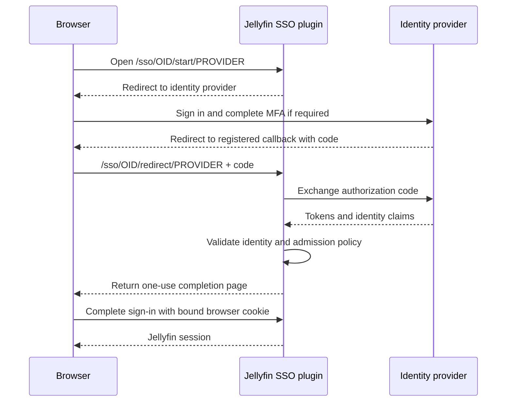

# Initial setup

!!! warning "Keep a recovery administrator"

    Use an isolated server and a non-administrator test account while the rewrite
    is being validated. Keep a separate local Jellyfin administrator account for
    recovery. The current implementation can change permissions on existing users.

1. [Install a compatible build](installation.md) and restart Jellyfin.
2. Create an application/client in your identity provider. Choose a
   [provider recipe](providers/index.md) and use a stable plugin provider name,
   such as `authentik`. This name becomes part of callback URLs.
3. For OIDC, open the SSO plugin settings in Jellyfin's dashboard and choose
   **Add provider**. In **Connection**, enter the issuer URL, client ID and secret,
   then enable **Allow sign-in** and save. SAML has no dashboard
   editor yet; use the [administrative API](reference/api.md#administration) to
   configure its endpoint, client ID and certificate.
4. Configure [admission and permission rules](configuration.md#permissions).
   Start with explicit allowed groups and no administrator role.
5. Register the exact callback URL shown in the [route reference](reference/api.md).
   Include your public HTTPS host, port if nonstandard, and Jellyfin base path.
6. Open `/sso/OID/start/PROVIDER_NAME` or `/sso/SAML/start/PROVIDER_NAME` under your
   Jellyfin URL. Complete the provider login and confirm the correct local user,
   library access, administrator status, and Live TV permissions.
7. Sign out and repeat with a user outside the allowed group to verify denial.

## How OIDC sign-in works

The login button opens Jellyfin's **start URL**. The identity provider sends the
browser back to the **registered callback** after authentication. Jellyfin then
exchanges the authorization code with the provider and checks the identity and
admission policy before completing the browser session.



Both Jellyfin URLs include the public host and any base path. Register the
callback with the IdP; use the start URL for the login button. The code exchange
also requires Jellyfin's runtime to reach the IdP, even when the browser can
already reach it. See [proxy and discovery diagnostics](troubleshooting.md).

SAML uses a browser form POST to `/sso/SAML/post/PROVIDER` with a signed assertion
instead of the OIDC callback and code exchange shown above. The [route reference](reference/api.md#browser-flow)
lists both protocols and their legacy aliases.

## Login button

The inherited Jellyfin Web integration used an HTML form in the dashboard's
branding/login disclaimer setting:

```html
<form action="https://jellyfin.example.com/sso/OID/start/authentik">
  <button class="raised block emby-button button-submit">
    Sign in with SSO
  </button>
</form>
```

Use `SAML` instead of `OID` for SAML. Include a configured Jellyfin base path
before `/sso/`. A provider name is a URL path segment; use a simple name without
spaces or slashes for new configurations.

Older clients sometimes needed this custom CSS:

```css
.disclaimerContainer {
  display: block;
}
```

These branding instructions are inherited from upstream. Jellyfin 12's Modern
and Legacy web clients need separate validation; a hidden or sanitized button
is not evidence of a provider configuration problem. Test the direct start URL
first. See [client support](accounts-and-clients.md#clients).

## Optional branding

To size only the SSO button, add a custom class such as `sso-login-button` to the
button above and style it in Jellyfin's custom CSS:

```css
.sso-login-button {
  min-height: 2.75rem;
  width: 100%;
  white-space: normal;
}
```

Hiding the local login form is optional presentation, not access control. It does
not disable password login or direct API access. No form-hiding selector is
certified here for Jellyfin 12's Modern and Legacy layouts. If you choose to hide
it, inspect the active layout, scope the selector to its local-login form, and
verify that the SSO button, Quick Connect, keyboard access, and recovery path
remain usable. Keep an authenticated administrator session available to undo the
CSS, and retest after web-client upgrades. See [branding diagnostics](troubleshooting.md#browser-assets-and-branding)
for cosmetic-filter and missing-button checks.
