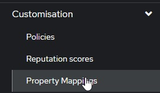
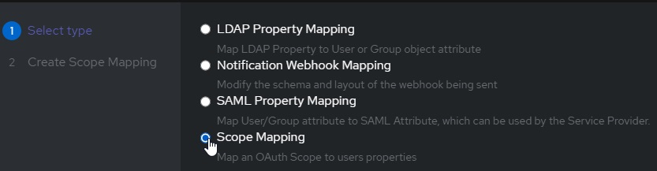
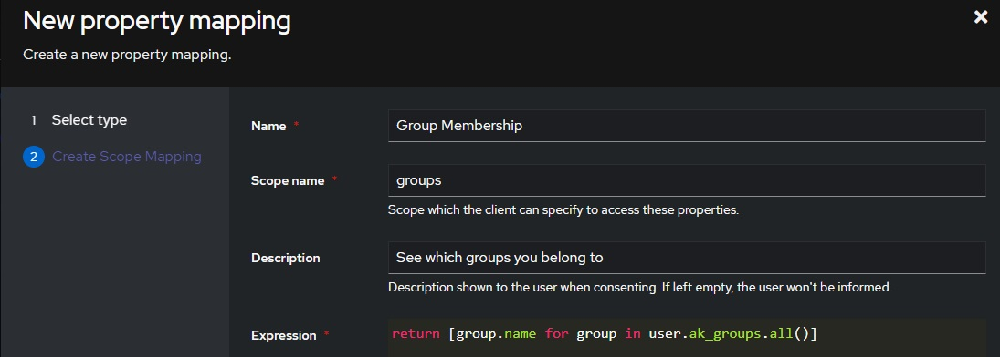
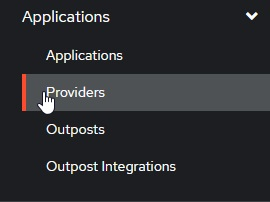
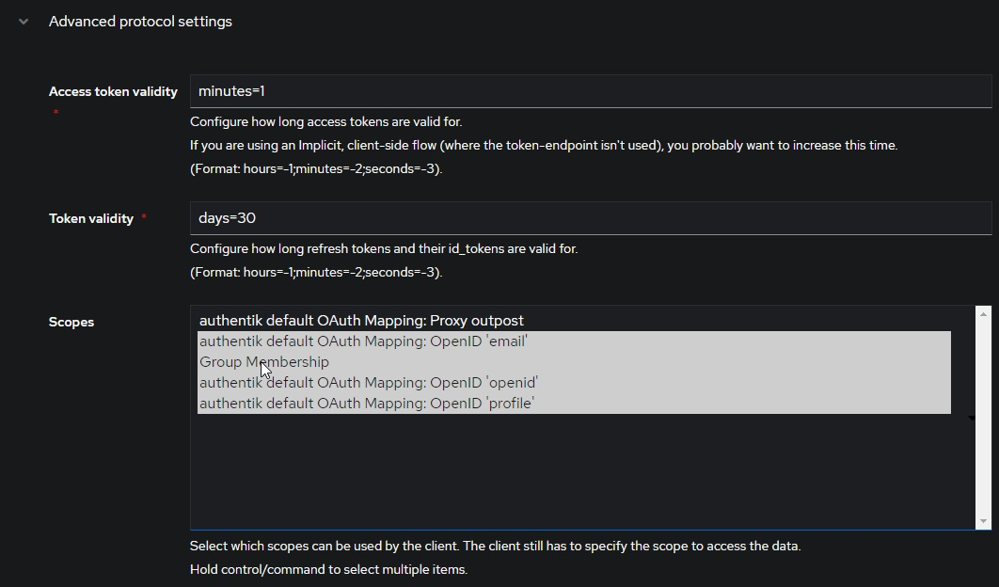

# authentik

!!! note "Recipe validation status"

    This recipe is inherited from upstream and has **not been revalidated on
    Jellyfin 12**. Provider UI labels may differ by version. Use the
    [provider's documentation](https://docs.goauthentik.io/integrations/services/jellyfin/) for current administration steps.

Follow [initial setup](../getting-started.md) and review
[permissions](../configuration.md#permissions) first. YAML blocks below describe
plugin field values; the plugin does not import YAML. Include explicit shared
policy fields when using the JSON API.

To begin with, we must set up an OIDC provider + application in authentik. Refer to the official documentation for detailed instruction.

### authentik's Config

authentik supports RBAC, but is slightly more complicated to configure than Authelia, as we need to configure a custom scope binding to include in the OIDC response.

To do this, we:

- create a **Custom Property Mapping**

  

- Create a **Scope Mapping**

  

- Assign the following attributes:

  

  ```yaml
  # A nice, human readable name
  name: Group Membership
  # The name of the scope a client must request to get access to a user's groups
  Scope Name: groups
  # A description of what is being requested to show to a user
  Description: See Which Groups you belong to
  ```

- For the **Expression** field, use the following code:
  ```python
  return [group.name for group in user.ak_groups.all()]
  ```

Now we can add this property mapping to authentik's Jellyfin OAuth provider:

- Navigate to `Applications/providers`

  

- Edit / Update your Jellyfin OAuth provider
- Verify your **"Redirect URIs/Origins (RegEx)"** follows the format: `https://jellyfin.example.com/sso/OID/redirect/authentik`.
- Under **"Advanced Protocol Settings"**, add the **Group Membership** Scope

  

### Jellyfin's Config

On Jellyfin's end, we need to configure an authentik provider as follows:

In order to test group membership, we need to request authentik's OIDC scope `groups`, which we will use to check user roles.

```yaml
authentik:
  OidEndpoint: https://authentik.example.com/application/o/jellyfin
  OidClientId: <same-as-in-authentik>
  OidSecret: <redacted>
  RoleClaim: groups
  OidScopes: ["groups"]
```

For discovery authority errors, first verify the issuer URL and endpoint hosts against your authentik configuration. See [discovery troubleshooting](../troubleshooting.md); do not disable endpoint validation as a default.

Use the exact provider key `authentik` from the example in both the login and
callback URL. Match `OidEndpoint` to the issuer mode selected in authentik and
verify its discovery document; do not copy an application path from another
installation. See [discovery diagnostics](../troubleshooting.md#discovery-and-claims-diagnostics).
The client must issue signed ID tokens without encryption; this plugin has no
JWE decryption-key configuration. See [supported tokens and claims](../configuration.md#oidc-settings).
